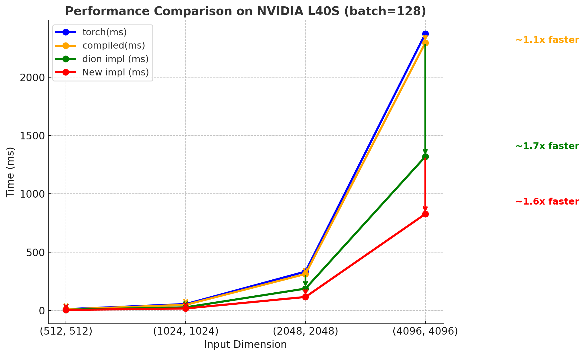
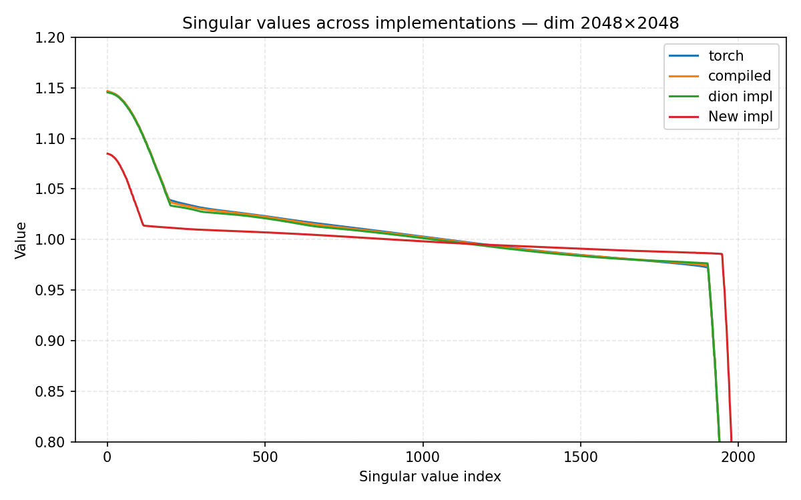

# flash-newton-schulz
My attempt to improve the speed of the newton schulz algorithm, starting from the dion implementation.

Disclaimer: this work is still in progress, especially I want ot highlight that this approach change the 
underlying algorithm. So extra verification should be done before integrating it in optimizers like dion/muon.

## Changes

For this implementation I started from the [dion implementation of newton schulz](https://github.com/microsoft/dion)
which has a great triton implementation of the newton schulz algorithm.

### triton kernel for ns_line_3:

I noticed that the ns_line_3 function was taking a lot of time, so I wrote a triton kernel to avoid multiple
loading of the same data. This give a marginal speedup on small matrices, where loading data is the bottleneck.

### Fewer iterations:

we remove the previous normalization to switch to AOL rescaling
Which is further explained in the paper: https://arxiv.org/pdf/2208.03160

This consists in computing W@W^t using ns_line_1 and then computing the
scaling factors: fast_inv_sqrt(reduce_sum(abs(WW^t), axis=-1)) which is a vector

Since the main operation to compute those correspond to ns_line_1,
we can fuse it with the first newton schulz iterate. Furthermore this gives a better
starting point for the newton schulz iterations as the matrix is closer to orthogonal

Thanks to this, we can save one iteration of newton schulz. However, the non linear nature of AOL prevent from using 
Jiacheng's approach to compute new polynomials factors. So we rely on a genetic algorithm to optimize those.
This is done in the file `opt_params.py` which can be run to find better polynomials.

## TODOs:

We have some nice improvements on the NS algorithm, but there are still things to check before using it in optimizers like
dion.

Before active use in optimizers we need to check that:
1. the matrix is still close to the original one (ie. AOL does not send the matrix to far from its oiriginal value)
2. optimization is done using matrices filled with gaussian values, but in practice we will use it on matrices 
which are the gradient of a layer, which might have a different distribution. We need to verify if the parameters 
are stable for practical training. (testing was done on uniform values to check stability, but this is 
not a proof of generalization)

## Current results:

Using a L40S GPU, we obtain a decent speedup:



When tested on random uniform matrices, the matrices seems closer to orthogonal:



## Citation

```
@misc{lin2025flash,
  author       = {Thibaut Boissin},
  title        = {flash-newton-schulz: AOL rescaling and triton kernel for newton schulz},
  year         = {2025},
  url          = {https://github.com/thib-s/flash-newton-schulz}
}
```